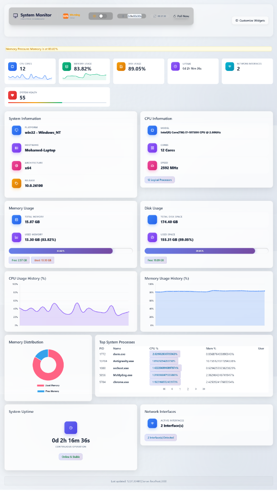

# 📊 System Dashboard (SysDashboard)

A high-performance, real-time system monitoring dashboard built with **Angular 21**, **Signals**, **PrimeNG 21**, and **Node.js**. Monitor your system's health, CPU usage, memory distribution, disk activity, and active processes from a beautiful, glassmorphic interface.



## ✨ Features

- **Real-time Monitoring**: Live updates of CPU, Memory, and Disk usage using a signal-driven architecture.
- **Historical Analysis**: Visualized trends with CPU and Memory history charts (Chart.js).
- **Process Management**: Top 10 CPU-intensive processes listed with real-time stats.
- **Widget Customization**: Toggle individual monitoring widgets on/off to customize your view.
- **Modern UI/UX**:
    - **Glassmorphism**: Premium frosted-glass header and card designs.
    - **Dark Mode**: Seamless theme switching with persistent brightness awareness.
    - **Tailwind CSS v4**: Blazing fast styling with the latest Tailwind features.
- **Performance Optimized**: 
    - Parallelized backend data gathering.
    - "Poll-after-response" pattern to eliminate network request cancellations.
    - Zero-animation sparklines for high-frequency updates to keep the main thread idle.

## 🛠️ Tech Stack

- **Frontend**: Angular 21 (Standalone), RxJS, Signals.
- **UI Components**: PrimeNG 21, PrimeIcons.
- **Styling**: Tailwind CSS v4, Vanilla CSS variables.
- **Charts**: Chart.js.
- **Backend**: Node.js, Express.
- **System Stats**: `systeminformation` library.

## 🚀 Getting Started

### Prerequisites

- [Node.js](https://nodejs.org/) (v18.0.0 or higher)
- [npm](https://www.npmjs.com/) (v9.0.0 or higher)

### Installation

1. **Clone the repository**:
   ```bash
   git clone https://github.com/MohamedSamyHossebo/sys-dashboard.git
   cd sys-dashboard
   ```

2. **Install dependencies**:
   ```bash
   npm install
   ```

### Running the Application

This project requires both the backend API and the frontend dev server to be running.

1. **Start the Backend Server (Port 3000)**:
   ```bash
   node server.js
   ```

2. **Start the Frontend (Port 4200)**:
   ```bash
   npm start
   ```

3. **Open your browser**:
   Navigate to `http://localhost:4200` to view your dashboard.

## ⚙️ Configuration

- **Refresh Rate**: You can adjust the polling interval (1s, 5s, 10s, 30s) directly from the header.
- **Proxy**: The frontend is configured to proxy `/api` requests to `localhost:3000` via `proxy.conf.json`.

## 🧪 Development

### Code Scaffolding
Run `ng generate component component-name` to generate a new component.

### Building
Run `npm run build` to build the project. The build artifacts will be stored in the `dist/` directory.

---

Developed with ❤️ using modern Angular best practices.
